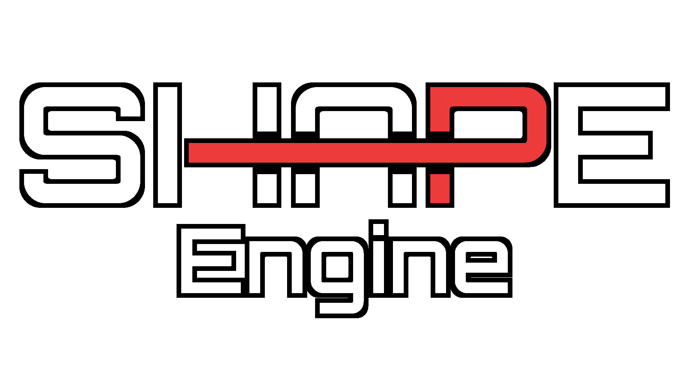
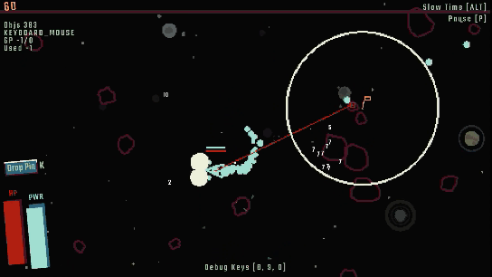
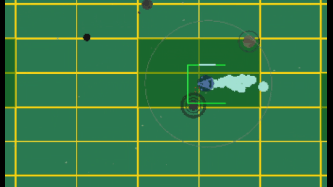

# ShapeEngine
My custom-made engine based on the great [Raylib Framework](https://www.raylib.com/examples.html). The Main focus is being performant and only using draw functions instead of textures.

When using the Shape Engine everything from Raylib is available as well. ([Raylib Examples](https://www.raylib.com/examples.html), [Raylib Cheatsheet](https://www.raylib.com/cheatsheet/raylib_cheatsheet_v4.0.pdf))

## Demo Showcose
The demo is included in this repository. The demo is just a simple asteroid shooter like game. It consist of a main menu and 1 level with the player ship and randomly spawning asteroids. The demo tries to show the most important aspects of Shape Engine´s usage, like how to play music in a playlist, playing and adding sounds, using the data/shader/level/ui system, and many more things!

Gameplay

Spatial Hash / Collision System

## Documentation
Right now there is no documentation.  There is a Visual Studio Template in the Release Folder and a complete Demo Game to see how everything works.

## Dependencies
Shape Engine uses the following nuget packages:

- [Raylib CsLo](https://github.com/NotNotTech/Raylib-CsLo) (c# Bindings for Raylib)
- [Vortice.XInput](https://www.nuget.org/packages/Vortice.XInput) (Gamepad Vibration)
- [Newtonsoft.Json](https://www.nuget.org/packages/Newtonsoft.Json) (Data Handler Json Serialization/Deserialization)

## Known Problems/ Issues
- ResourceManager.LoadShader does not work right now because of a problem with the Raylib-CsLo LoadShaderFromMemory function.
- MonitorHandler has a simple hardcoded fix for raylibs GetMonitorSize function that sometimes reports wrong sizes. The problem is already fixed in raylib but not yet available in the bindings. This hardcoded fix probably leads to problems as well if you use screen sizes bigger than 2000x1250 but for me it works right now and I will update it to the correct version as soon as possible.
- Simple Collision is not finished yet. The entire collision system with the CollisionHandler and HashGrid System works right now but not all the dynamic collision functions are implemented yet. Only circle, segment, and point colliders work as collider class right now. If you want to use one of the other collider classes you have to set your ICollidable object as an area instead of a collider. (In the Demo the projectiles are actually areas while the player and asteroids are colliders)

## Limitations
- There is no physics system because I don´t need one and would´t know how to make one. There is complete collision system but the collision response is up to you. You can also use raylibs physics system.
- The UI system is functional but right now there is only a button class.
- To use the data system you have to use [Castle DB](http://castledb.org).

## History
I made Shape Engine because I wanted to help myself make games with a specific art style and certain limitations. At first, it started out with some helper scripts but now it is a relatively sophisticated system to make games with raylib. Certain parts of the basic game loop are inspired by [Bytepath](https://github.com/a327ex/BYTEPATH) and other things I already used in games that I made myself (especially [Fracture Hell](https://store.steampowered.com/app/1713770/Fracture_Hell)). 
Feel free to use any single part if you don´t want to use the whole package. Most scripts in the globals section are self contained and can just be used to make your raylib journey a little bit easier.
