My custom-made engine based on the great [Raylib Framework](https://www.raylib.com/examples.html). The Main focus is being performant and only using draw functions instead of textures.

When using Shape Engine everything from Raylib is available as well. ([Raylib Examples](https://www.raylib.com/examples.html), [Raylib Cheatsheet](https://www.raylib.com/cheatsheet/raylib_cheatsheet_v4.0.pdf))

> Shape Engine´s examples are available on [Itch](https://solobytegames.itch.io/shape-engine) as well and it is a great way to support me ;)

> More examples are available in the [ShapeEngineDemos repository](https://github.com/DaveGreen-Games/ShapeEngineDemos). Most of the bigger examples will be available here, like a small asteroids game.

> You are free to use Shape Engine or any part of Shape Engine for your own projects, but keep in mind that Shape Engine was designed to help me with my specific game dev needs. Nevertheless I am looking forward to creations that Shape Engine made possible :)


[Release Trailer](https://youtu.be/fmx9zICSe3Q)

## Showcase
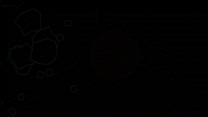
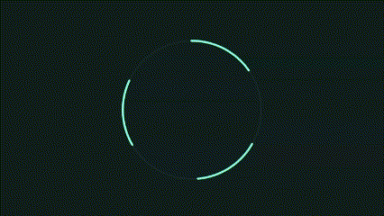
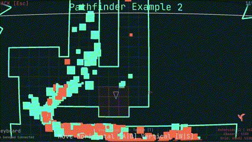
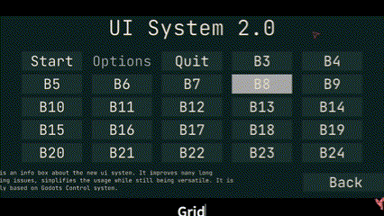
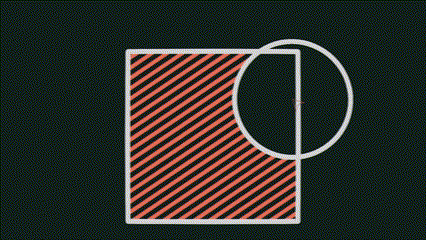
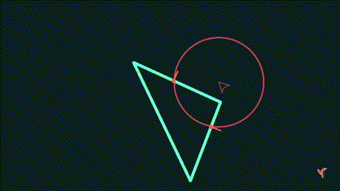
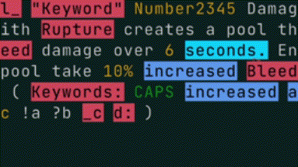
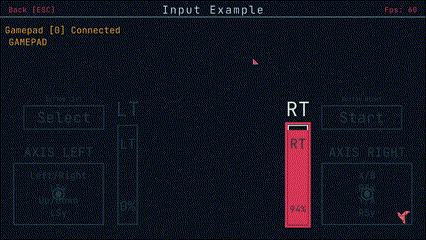
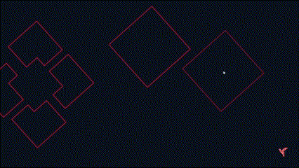
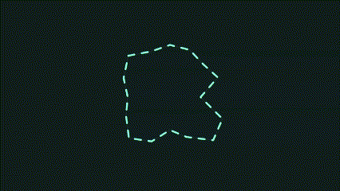
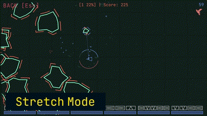


## Installation / How to Use

There are multiple ways to use Shape Engine:

1. **Create a new solution & project and download Shape Engine from the Nuget manager.** (Recommended)
```sh
dotnet add package DaveGreen.ShapeEngine
```
2. Clone or fork the repository and add new projects to the solution. You then can reference the Shape Engine project and start working on your game. The advantages are that you can easily change things in Shape Engine and everything updates automatically in your own project.
3. Create a new solution & project in a .net IDE. (Visual Studio / JetBrains Rider for example). Download or fork ShapeEngine and either create a local nuget package or build the solution to create all necessary dll files.
	1. [Using a local Nuget Package] Create a folder on your machine called something like “Local Nuget Packages” and copy the ShapeEngine Nuget package that you created to this folder. (You can also add the Shape Engine Nuget package directly to your Project). Now you need to create a new Package source in the Nuget Manager that points to your “Local Nuget Packages” Folder. This source can be used in your Nuget Manager to find and install the Shape Engine Nuget Package.
	2. You manually copy all needed DLL files to your project. You need the following DLLs: Clipper2Lib, Raylib-Cs, Microsoft.Toolkit.HighPerformance, Shape Engine Core, Raylib. All DLL files except Raylib can be anywhere in your projects folder hierarchy. The Raylib DLL must be on the root level of your project. You need to select the right Raylib DLL for your operating system. Now just add a reference for all DLLs except the Raylib DLL and you are done. On MacOS you need to do the same step except using the .dylib file instead of the raylib DLL. You need to set the property “Copy if Newer” to true on the .dylib file. Then everything should work.
4. Create a new solution & project and just add the Shape Engine Core DLL to your project and reference it. Now you need to download the right version of the Raylib_CsLo & Clipper2 Nuget packages. The releases on GitHub will state which versions were used.


## Minimal Project Setup

```c#

using System.Drawing;
using ShapeEngine.Color;
using ShapeEngine.Core;
using ShapeEngine.Core.Structs;
using ShapeEngine.Geometry;
using ShapeEngine.Geometry.RectDef;

namespace ShapeEngineProject;

public static class Program
{
    public static void Main(string[] args)
    {
	    var game = new MyGameClass(GameSettings.StretchMode("Shape Engine Game"), WindowSettings.Default, InputSettings.Default);
	    game.Run();
    }
}

public class MyGameClass : Game
{
    //Gives you static access to the instance of MyGameClass - If you do not need/want this, you can remove it.
    public new static MyGameClass Instance  => myInstance?? throw new NullReferenceException("Instance is not initialized! You need to create a MyGameClass instance before accessing this property!");
    private static MyGameClass? myInstance;
    
    public MyGameClass(GameSettings gameSettings, WindowSettings windowSettings, InputSettings inputSettings) : base(gameSettings, windowSettings, inputSettings) 
    {
        //Game.Instance is already checked to never be instantiated twice, so this is safe
        myInstance = GetInstanceAs<MyGameClass>();
    }
    
    protected override void DrawGame(ScreenInfo game)
    {
        game.Area.Draw(new ColorRgba(Color.DarkOliveGreen));
        game.Area.DrawLines(12f, new ColorRgba(Color.AntiqueWhite));
        game.MousePos.Draw(24f, new ColorRgba(Color.Lime), 36);
    }
}

```

## Getting Started & Documentation

This repository includes an **Examples Project** to showcase the capabilities of ShapeEngine and help you get started quickly. Explore the examples to see what’s possible and how to implement different features.

- **Documentation:**  
  Documentation is available [here](https://davegreen-games.github.io/ShapeEngineDocs/).

- **Documentation Source:**  
  You can find the documentation repository [here](https://github.com/DaveGreen-Games/ShapeEngineDocs).  

> For any issues, suggestions, or questions about the docs, please open an issue in the ShapeEngineDocs repository.


## Development Process

The Main Branch contains the current development stage. You can follow the development process here:


- [Reddit](https://www.reddit.com/r/ShapeEngine)
- [Twitter](https://twitter.com/ShapeEngine)
- [Instagram](https://www.instagram.com/shape.engine/)
- [YouTube](https://www.youtube.com/playlist?list=PLEbRWc6_ufK3DEopVejxU3_mI00FfFmZ4)
- [GitHub Discussions](https://github.com/DaveGreen-Games/ShapeEngine/discussions/categories/dev-updates)
- [Roadmap](https://github.com/DaveGreen-Games/ShapeEngine/discussions/4)


## Examples

> You can download the newest builds of the Example Project on [Itch io](https://davegreengames.itch.io/shape-engine). You can clone the repo and inspect the example projects there as well.

- Examples are simple scenes that focus on one specific area or feature of Shape Engine.
- Examples showcase the various capabilities of Shape Engine, allowing users to explore various features.
- The examples cover all major features of Shape Engine, ensuring that users can grasp its full potential.


## **Features**

> In general my goal is to provide the most relevant system a game dev needs without adding a solution for every possible problem.

- [Polygon Fracturing](https://youtu.be/RaKz4q_zYrg)
- [Delaunay Triangulation](https://youtu.be/eJqZB-e6m54)
- [Text & Font System](https://youtu.be/D3xLx7f1YqQ)
- [Word Emphasis System](https://youtu.be/wEz60lx8ef4)
- [Pathfinding](https://youtu.be/giVIGSfIO4k?si=KWRiGJvG8Roj0Qh2)
- UI System
- [Collision System](https://youtu.be/mJJZcDa2pRE)
- Audio & Music
- Savegame System
- Color Palettes
- [Input System (Keyboard, Mouse, Gamepad)](https://youtu.be/IUSnUw0x5ek?si=wr7aEmQD8JbeZAfl)
- [Camera System](https://youtu.be/BascnrqZn6Q)
- Screen Texture System
- [Gapped Drawing](https://youtu.be/_xBz9cArtBE)
- [Striped Drawing](https://youtu.be/lYkotZkr1fQ)
- [Shape Collision System 2.0](https://youtu.be/Ag8rDXmvHwk) with Segment, Line, Ray, Circle, Triangle, Quad, Rect, Polygon, Polyline


## Dependencies

I am just using the [Raylib Cs](https://github.com/ChrisDill/Raylib-cs) c# bindings and the [Cipper2](http://www.angusj.com/clipper2/Docs/Overview.htm) library for polygon clipping.

> If you use the nuget manager to download **Shape Engine as a nuget package** you don't have to take care of any dependencies, because they will be downloaded automatically.


## Limitations
There is no physics system because I don´t need one and would´t know how to make one. There is complete collision system but the collision response is up to you. You can also use raylibs physics system.


## History
I made Shape Engine because I wanted to help myself make games with a specific art style and certain limitations. At first, it started out with some helper scripts but now it is a relatively sophisticated system to make games with raylib. Certain parts of the basic game loop are inspired by [Bytepath](https://github.com/a327ex/BYTEPATH) and other things I already used in games that I made myself (especially [Fracture Hell](https://store.steampowered.com/app/1713770/Fracture_Hell)). 
Feel free to use any single part if you don´t want to use the whole package.


## Contact

> If you have an **issue**, or a **suggestion** for a new feature GitHub is the best way to get in contact with me.

- [GitHub Issues](https://github.com/DaveGreen-Games/ShapeEngine/issues)
- [GitHub Discussions](https://github.com/DaveGreen-Games/ShapeEngine/discussions)

> On these platforms you can follow the development process of Shape Engine, get in contact with me and always stay up date.

- [Reddit](https://www.reddit.com/r/ShapeEngine)
- [Twitter](https://twitter.com/ShapeEngine)
- [Instagram](https://www.instagram.com/shape.engine/)
- [YouTube](https://www.youtube.com/playlist?list=PLEbRWc6_ufK3DEopVejxU3_mI00FfFmZ4)
- [Itch Dev Logs](https://davegreengames.itch.io/shape-engine/devlog)


## Linktree

[https://linktr.ee/davegreen.games](https://linktr.ee/davegreen.games)

[https://linktr.ee/shapeengine](https://linktr.ee/shapeengine)

